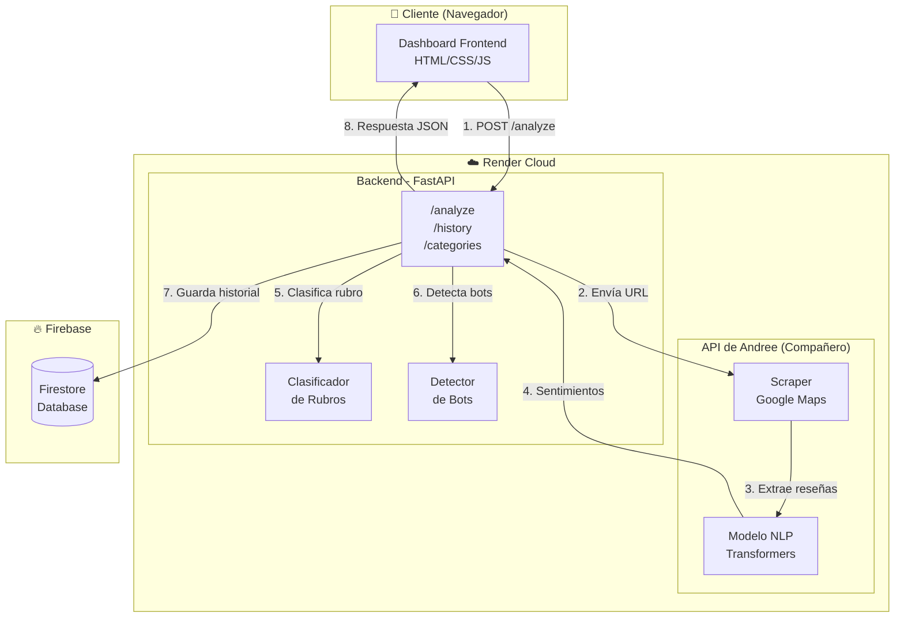
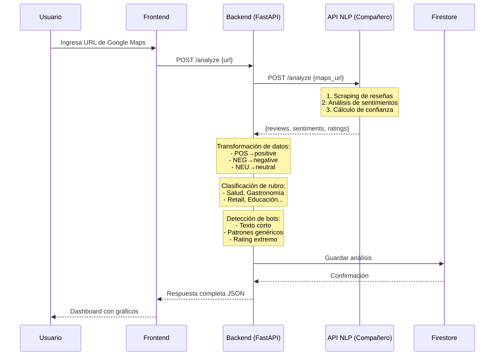
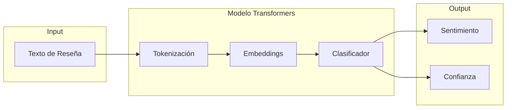
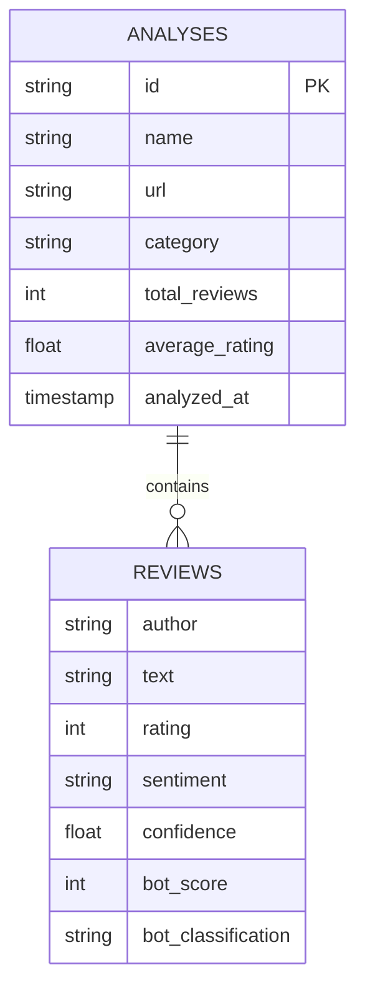

# 🏗️ Arquitectura del Sistema - SentimentAnalyzer

## 📋 Resumen Ejecutivo

**SentimentAnalyzer** es un sistema de análisis de sentimientos para reseñas de Google Maps que integra:
- Extracción automática de reseñas (scraping)
- Análisis de sentimientos con NLP (modelo Transformers)
- Detección de reseñas falsas (bots)
- Clasificación automática por rubro de negocio
- Dashboard interactivo con visualizaciones

---

## 🔗 URLs del Sistema (Actualizadas)

| Componente | URL |
|------------|-----|
| **Dashboard (Frontend)** | https://sentiment-dashboard-7etn.onrender.com |
| **API (Backend)** | https://analisisdesentimientos2026-1.onrender.com |
| **API Docs (Swagger)** | https://analisisdesentimientos2026-1.onrender.com/docs |
| **API del Modelo NLP (Andree)** | https://modelscrappyv2.onrender.com |
| **Repositorio** | https://github.com/adriancsc/AnalisisDeSentimientos2026 |

---

## 🏛️ Diagrama de Arquitectura General



---

## 🔄 Flujo de Datos Detallado



---

## 📦 Estructura del Proyecto

```
📁 AnalisisDeSentimientos2026/
├── 📁 backend/                 # API FastAPI
│   ├── main.py                 # Endpoints principales
│   ├── categories.py           # Clasificación de rubros
│   ├── history.py              # Historial local (JSON)
│   ├── history_firestore.py    # Historial en Firebase
│   ├── firebase_config.py      # Configuración Firebase
│   └── requirements.txt        # Dependencias Python
│
├── 📁 frontend/                # Dashboard Web
│   ├── index.html              # Página principal
│   ├── styles.css              # Estilos (glassmorphism)
│   └── app.js                  # Lógica JavaScript
│
└── 📄 README.md
```

---

## 🔌 API Endpoints

### Backend Principal (FastAPI)

| Método | Endpoint | Descripción |
|--------|----------|-------------|
| `GET` | `/` | Info de la API y endpoints disponibles |
| `POST` | `/analyze` | Analiza una URL de Google Maps |
| `GET` | `/history` | Obtiene historial completo |
| `GET` | `/history/category/{id}` | Historial filtrado por rubro |
| `GET` | `/categories` | Lista de rubros disponibles |
| `GET` | `/stats` | Estadísticas generales |

### Ejemplo de Request/Response

**Request:**
```json
POST /analyze
{
  "url": "https://maps.app.goo.gl/sD5aWDDEWYMQTmaL7",
  "business_name": "Clínica San Gabriel"
}
```

**Response:**
```json
{
  "id": "abc123",
  "name": "Clínica San Gabriel",
  "url": "https://maps.app.goo.gl/...",
  "category": "salud",
  "total_reviews": 45,
  "average_rating": 4.2,
  "sentiment_summary": {
    "positive": 30,
    "neutral": 10,
    "negative": 5
  },
  "bot_stats": {
    "real": 40,
    "suspicious": 3,
    "bot": 2
  },
  "reviews": [
    {
      "author": "Juan Pérez",
      "text": "Excelente atención...",
      "rating": 5,
      "sentiment": "positive",
      "confidence": 0.95,
      "bot_score": 15,
      "bot_classification": "real"
    }
  ]
}
```

---

## 🧠 Componentes Técnicos

### 1. Análisis de Sentimientos (NLP)



| Código | Sentimiento | Descripción |
|--------|-------------|-------------|
| `POS` | Positivo | Reseña favorable |
| `NEU` | Neutral | Reseña sin opinión clara |
| `NEG` | Negativo | Reseña desfavorable |

### 2. Detector de Bots

Algoritmo basado en patrones sospechosos:

| Indicador | Puntos | Descripción |
|-----------|--------|-------------|
| Texto < 20 caracteres | +25 | Reseñas muy cortas |
| Frases genéricas | +25 | "Excelente", "Muy bueno", "Ok" |
| Rating extremo (1 o 5) | +20 | Sin matices |
| Sin detalles específicos | +15 | No menciona productos/servicios |
| Patrón repetitivo | +15 | Texto similar a otras reseñas |

**Clasificación:**
- 🟢 **Real** (0-30 puntos)
- 🟡 **Sospechoso** (31-60 puntos)
- 🔴 **Bot** (61-100 puntos)

### 3. Clasificador de Rubros

Categorías automáticas basadas en palabras clave:

| Rubro | Palabras Clave |
|-------|----------------|
| 🏥 Salud | clínica, hospital, doctor, médico, dental |
| 🍽️ Gastronomía | restaurante, café, comida, pizza, sushi |
| 🏨 Hospedaje | hotel, hostal, airbnb, habitación |
| 🛒 Retail | tienda, supermercado, mall, ropa |
| 📚 Educación | colegio, universidad, academia, curso |

---

## 🗄️ Base de Datos (Firestore)



---

## 🛠️ Tecnologías Utilizadas

| Capa | Tecnología | Propósito |
|------|------------|-----------|
| **Frontend** | HTML5, CSS3, JavaScript | Interfaz de usuario |
| **Estilos** | CSS Variables, Glassmorphism | Diseño moderno |
| **Gráficos** | Chart.js | Visualización de datos |
| **Backend** | FastAPI (Python) | API REST |
| **NLP** | Transformers (HuggingFace) | Análisis de sentimientos |
| **Scraping** | Playwright | Extracción de reseñas |
| **Database** | Firebase Firestore | Persistencia en la nube |
| **Hosting** | Render | Deploy del backend y frontend |

---

## 🔐 Seguridad

- **CORS**: Configurado para permitir peticiones del frontend
- **Variables de entorno**: Credenciales de Firebase en Render
- **HTTPS**: Todas las conexiones encriptadas
- **Rate Limiting**: Límite de peticiones por IP (implícito en Render)

---

## 📊 Métricas del Sistema

El dashboard muestra:

1. **Distribución de Sentimientos** - Gráfico de dona (positivo/neutral/negativo)
2. **Detección de Bots** - Gráfico de barras (real/sospechoso/bot)
3. **Rating Promedio** - Estrellas visuales
4. **Historial por Rubro** - Filtros y estadísticas

---

## 👥 Equipo de Desarrollo

| Rol | Responsabilidad |
|-----|-----------------|
| **Adrian** | Frontend, Backend, Integración, Deploy |
| **Andree** | API de NLP (modelscrappyv2), Scraping, Modelo de Sentimientos |

---

## 📚 Referencias

- [FastAPI Documentation](https://fastapi.tiangolo.com/)
- [HuggingFace Transformers](https://huggingface.co/transformers/)
- [Firebase Firestore](https://firebase.google.com/docs/firestore)
- [Render Deployment](https://render.com/docs)
- [Chart.js](https://www.chartjs.org/)
